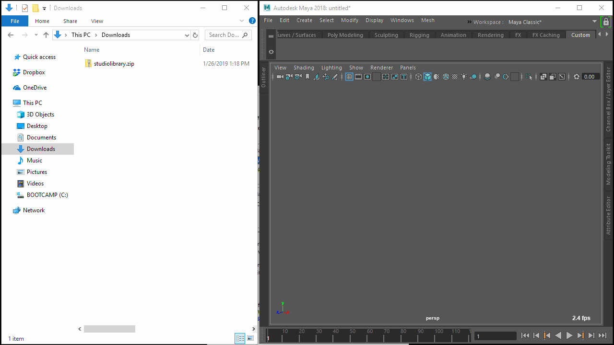

Studio Library is a python-based Qt tool for managing poses and animation in Maya.

## Features 

* Save poses and animation
* Mirror poses and animation
* Create easy to use selection sets
* MMB drag for fast pose blending
* LMB drag and drop to organize items
* Insert, merge and replace animation
* Supports Windows, Linux and OSX
* Supports Maya 2018+

## Tutorials

* [How to use poses](https://www.youtube.com/watch?v=lpaWrT7VXfM)
* [How to use selection sets](https://www.youtube.com/watch?v=xejWubal_j8)
* [How to use mirror tables](https://www.youtube.com/watch?v=kCv0XleJfjU&t=3s)

## Installation

1. Download and unzip the *studiolibrary.zip* file from [github releases](https://github.com/krathjen/studiolibrary/releases) or [website](http://www.studiolibrary.com/download).

2. Drag and drop the "studiolibrary/install.mel" file onto the Maya viewport.

3. Click the Studio Library icon on the shelf to run.

Tip: If you would like to share the Studio Library with other users then
place the unzipped "studiolibrary" folder on a network drive.

## Documentation

Find the latest documentation [here](DOCS.md).

## Merge Requests

The next major release is in active development. In order to ensure smooth progress, we kindly request that merge requests primarily focus on fixes or small changes. Thank you. 

## Contributing

Contributions to Studio Library are always welcome! Whether it's reporting bugs, feature requests, discussing ideas or committing code.

We follow the below guides for...

* [Commit messages style](https://github.com/erlang/otp/wiki/Writing-good-commit-messages)
* [GitHub Forking Workflow](https://gist.github.com/Chaser324/ce0505fbed06b947d962)
* [Python Qt Style Guidelines](http://bitesofcode.blogspot.co.uk/2011/10/pyqt-coding-style-guidelines.html)

## License

The Studio Library is free to use in production under the GNU Lesser General Public License v3.0.
For more information please click [here](LICENSE.md).

## Support

Comments, suggestions and bug reports are welcome.

Feel free to submit any issues with the error message and a detailed step by step process of how you got the error in [github issues](https://github.com/krathjen/studiolibrary/issues/new) or contact [support@studiolibrary.com](support@studiolibrary.com).